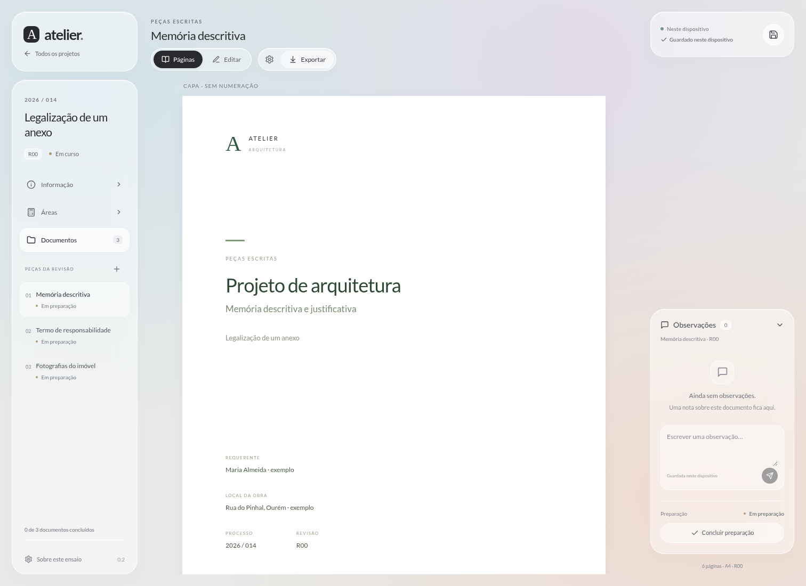

# Atelier — demonstração de peças escritas

Demonstração com dados e imagens fictícios. O projeto de desenvolvimento e os anexos originais continuam privados.

## Como ficou

[Ver o editor](site/vista-do-editor.png) · [Descarregar a demonstração ZIP](https://github.com/edgarerr/atelier-demo/raw/refs/heads/main/site/Atelier-demonstracao.zip)

## Abrir como aplicação

**[Abrir a demonstração](https://edgarerr.github.io/atelier-demo/)**

Publicação confirmada pelo GitHub Pages em 7 de outubro de 2026: workflow [37664542099](https://github.com/edgarerr/atelier-demo/actions/runs/37664542099), estado Success. O proprietário ativou GitHub Actions em Settings → Pages. O repositório de desenvolvimento e os anexos originais mantêm-se privados.

## O que pode experimentar

- Alterar dados em Informação e Áreas, à esquerda, e conferir os campos nos documentos.
- Modificar áreas e observar os resultados calculados.
- Editar texto e inserir campos com `/`.
- Conferir capa, índice e páginas.
- Experimentar os painéis translúcidos e as ferramentas à direita ao editar.
- Guardar observações locais por documento e regressar à lista de projetos.
- Exportar para Word ou usar a impressão do navegador para gerar PDF.

## Limites desta versão

Usar apenas dados fictícios. Os dados são guardados neste navegador, sem contas, sincronização ou revisões protegidas. A cópia publicada é uma demonstração HTML autónoma: abrir o endereço online exige ligação; não foi instalada a cache offline completa da futura aplicação.

A edição é contínua, com visualização paginada separada. A edição diretamente nas páginas, a fidelidade do Word em Windows/macOS e PDF/A continuam por validar. Não utilizar para entregas.

Esta distribuição contém apenas a aplicação compilada, imagens fictícias, instruções e licenças. Não inclui histórico ou documentos do repositório privado. Consultar `site/LICENCAS.txt`. Nenhum serviço pago foi contratado.
